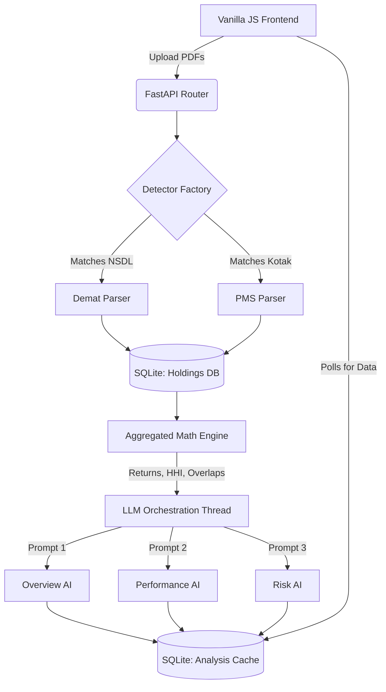

# VIKABH — Wealth Intelligence 📊🤖


**VIKABH** is an enterprise-grade, AI-powered portfolio analytics and wealth intelligence platform. 

It solves the notoriously difficult problem of unstructured financial data by deterministically parsing raw PDF statements (Demat, PMS, Mutual Funds), calculating true mathematical performance metrics, and orchestrating targeted Generative AI (LLMs) to write bespoke financial narratives, risk alerts, and performance summaries.

All of this is wrapped in a lightning-fast, zero-dependency Single Page Application (SPA) dashboard.

---

## ✨ Core Features

### 1. Intelligent PDF Extraction
* **Factory Pattern Architecture:** Financial institutions frequently change their statement formats. VIKABH uses a `detector.py` factory pattern to identify the broker (e.g., Kotak, HDFC, Enam) and route the PDF to an isolated, specialized parser. 
* **Zero-Hallucination Parsing:** Instead of relying on LLMs to read tables (which causes quantity hallucinations), PyMuPDF deterministically tracks vertical layouts and Regex blocks to extract 100% accurate quantities, buy prices, and current values.

### 2. Multi-Account Aggregation (Family Office View)
* Upload multiple distinct accounts (e.g., Wife's Demat, Husband's PMS) to a single Client profile.
* The system mathematically calculates both **Account-Level** metrics and **Consolidated Family-Level** metrics.
* **Instant Pivoting:** Use the dashboard dropdown to seamlessly toggle between the aggregated Family view and isolated individual accounts without reloading the page.

### 3. Targeted LLM Orchestration
To prevent LLM degradation from massive prompt context, VIKABH splits the AI reasoning into four isolated, parallel calls per account:
* **Overview AI:** High-level asset allocation and health narratives.
* **Performance AI:** Deep dive into top winners and worst drags.
* **Risk AI:** Analyzes HHI (Herfindahl-Hirschman Index) concentration and cross-account overlaps.
* **Insights AI:** Generates actionable 3-4 bullet alerts (Danger, Warning, Success).

### 4. Zero-Latency Dashboard
LLMs take 15-20 seconds to run. The FastAPI backend orchestrates uploads sequentially and runs the LLM calls in a background thread, saving the outputs to an `AnalysisCache` SQLite table. The Vanilla JS frontend polls this state and loads instantly once the cache is populated.

---

## 🏗️ System Architecture



---

## ⚙️ Installation & Setup

### 1. Clone the Repository
```bash
git clone https://github.com/ritanshubirla-07/wealth-management.git
cd wealth-management
```

### 2. Set Up the Virtual Environment
Ensure you have Python 3.11+ installed.
```bash
python -m venv venv

# Windows
venv\Scripts\activate
# Mac/Linux
source venv/bin/activate

pip install -r requirements.txt
```

### 3. Configure the Environment (.env)
Create a `.env` file in the root directory. You can use any OpenAI-compatible endpoint (OpenAI, Groq, Scaleway, Cerebras, local vLLM).

```ini
# Example for OpenAI
OPENAI_API_KEY=sk-your-openai-key

# Example for Custom Provider (e.g., Scaleway / LLaMA 3)
LLM_BASE_URL=https://api.scaleway.ai/v1/chat/completions
LLM_API_KEYS=your-api-key-here
LLM_MODEL=llama-3.3-70b-instruct
```

### 4. Boot the Server
Start the FastAPI server. The SQLite database (`VIKABH.db`) will automatically initialize on startup.
```bash
python -m uvicorn app.main:app --host 0.0.0.0 --port 8000 --reload
```

---

## 🖥️ User Workflow

1. **Client Directory:** Open `http://localhost:8000/`. You will land on the Client Directory. Click **"New Client"** to create a family profile.
2. **Staging Area:** Click on the newly created client card to open `upload.html`. Drag and drop all relevant Demat and PMS PDF statements into the drop-zone.
3. **Sequential Uploading:** Click **"Analyze Portfolio"**. The frontend sequentially queues the files to prevent database locks, triggering the LLM engine only on the final file.
4. **AI Generation Spinner:** A loading spinner will appear for ~15 seconds while the backend crunches the raw math and queries the LLM API.
5. **Dynamic Dashboard:** Once the AI finishes, you are instantly redirected to `dashboard.html`. Here, you can navigate between Portfolio, Performance, Risk, and Insights tabs. 
6. **Account Toggling:** Use the top-right dropdown to instantly pivot the dashboard from the Aggregated Family View to specific individual accounts.

---

## 📂 Project Structure

```text
wealth-management/
├── app/
│   ├── main.py              # FastAPI application & static mounting
│   ├── database.py          # SQLite connection and session maker
│   ├── models.py            # SQLAlchemy ORM definitions (Client, Account, Holding, Cache)
│   ├── analysis.py          # Pure math calculations (HHI, Weighted Avg)
│   ├── llm.py               # AI orchestration and prompt engineering
│   ├── routers/             # API Endpoints (Upload, Overview, Portfolio, etc.)
│   └── parsers/             # PyMuPDF extraction logic
│       ├── detector.py      # Factory router for PDFs
│       ├── demat.py         # Standard NSDL/CDSL parsers
│       └── pms.py           # Custom PMS format parsers
├── frontend/                # Zero-dependency SPA
│   ├── clients.html         # Client CRUD UI
│   ├── upload.html          # Drag-and-Drop & Polling UI
│   ├── dashboard.html       # Final UI Template
│   └── dashboard.js         # Dynamic DOM manipulation & Chart.js logic
├── .env.example             # Environment templates
└── requirements.txt         # Python dependencies
```
